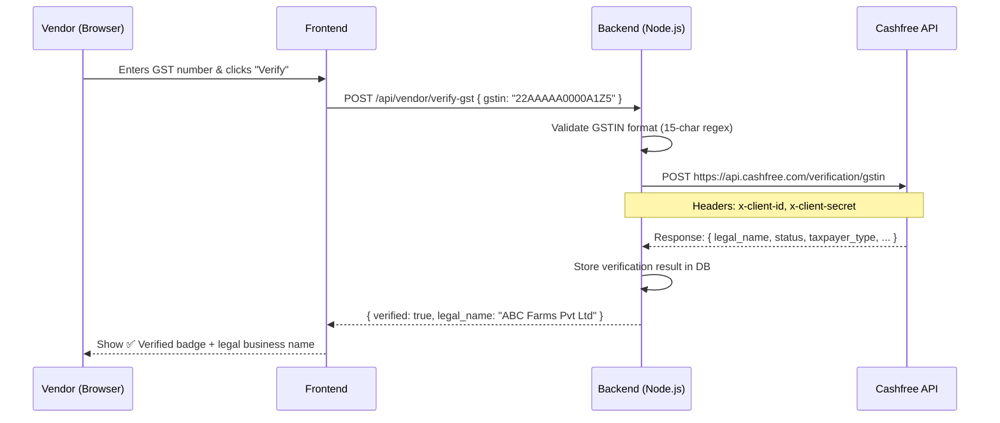

# Cashfree GST Verification Integration

Integrate real GST (GSTIN) verification into FarmEasy's vendor system using the **Cashfree Verification API**. Existing vendors remain functional but are shown as **"Not Verified"** until they complete the verification flow.

## User Review Required

> [!IMPORTANT]
> **Cashfree Account Required**: You need a Cashfree account with the **Verification Suite** (Secure ID) enabled.
> - Sign up at [https://merchant.cashfree.com](https://merchant.cashfree.com)
> - Go to **Developers → API Keys** to get your `Client ID` and `Client Secret`
> - The Verification API has a **sandbox/test mode** — use test credentials first
> - Cashfree charges per verification call (~₹2-5 per GST verification)

> [!WARNING]
> **Existing vendors** will automatically appear as **"Not Verified"** after this change. They will NOT lose any functionality — they can still list products, receive orders, etc. They simply need to click "Verify GST" from their profile to get the verified badge.

## Open Questions

> [!IMPORTANT]
> 1. **Do you have a Cashfree merchant account already?** If not, you'll need to create one and enable the Verification API.
> 2. **Should GST be mandatory for new vendor registration?** Currently it's optional. We can keep it optional at registration and let vendors verify later from their profile.
> 3. **Should unverified vendors have any restrictions?** (e.g., product listing limit, no orders) Or just show the "Not Verified" badge with no restrictions?

---

## How Cashfree GST Verification Works



**Cashfree API Details:**
- **Endpoint**: `POST https://api.cashfree.com/verification/gstin` (Production)
- **Sandbox**: `POST https://sandbox.cashfree.com/verification/gstin`
- **Headers**: `x-client-id`, `x-client-secret`, `Content-Type: application/json`
- **Body**: `{ "gstin": "22AAAAA0000A1Z5" }`
- **Response includes**: `legal_name`, `trade_name`, `status` (Active/Cancelled/Suspended), `taxpayer_type`, `registration_date`, `address`

---

## Proposed Changes

### Database Schema

#### [MODIFY] `seller` table — Add verification columns

```sql
ALTER TABLE seller
  ADD COLUMN gst_verified TINYINT(1) DEFAULT 0,
  ADD COLUMN gst_legal_name VARCHAR(255) DEFAULT NULL,
  ADD COLUMN gst_trade_name VARCHAR(255) DEFAULT NULL,
  ADD COLUMN gst_status VARCHAR(50) DEFAULT NULL,
  ADD COLUMN gst_verified_at TIMESTAMP NULL DEFAULT NULL;
```

- `gst_verified` — `0` = not verified, `1` = verified via Cashfree
- `gst_legal_name` — Legal business name returned by Cashfree
- `gst_trade_name` — Trade name returned by Cashfree
- `gst_status` — GST registration status (`Active`, `Cancelled`, `Suspended`)
- `gst_verified_at` — Timestamp of last successful verification

> Existing vendors automatically have `gst_verified = 0` (Not Verified) due to the DEFAULT value.

---

### Backend Changes

#### [MODIFY] [.env](file:///c:/Users/kunal/OneDrive/Desktop/FarmEasy/backend/.env)

Add Cashfree credentials:
```env
# Cashfree Verification API
CASHFREE_CLIENT_ID=your_client_id_here
CASHFREE_CLIENT_SECRET=your_client_secret_here
CASHFREE_ENV=sandbox
```
Set `CASHFREE_ENV=production` when going live.

---

#### [NEW] [gstVerificationController.js](file:///c:/Users/kunal/OneDrive/Desktop/FarmEasy/backend/controllers/gstVerificationController.js)

New controller with one main function:

**`verifyGST(req, res)`**
1. Extract `gstin` from request body
2. Validate format with regex: `^[0-9]{2}[A-Z]{5}[0-9]{4}[A-Z]{1}[1-9A-Z]{1}Z[0-9A-Z]{1}$`
3. Check if this vendor already has a verified GST (prevent duplicate API calls)
4. Call Cashfree API: `POST /verification/gstin`
5. If Cashfree returns valid data with `status: "Active"`:
   - Update `seller` table: set `gst_verified = 1`, store `gst_legal_name`, `gst_trade_name`, `gst_status`, `gst_no`, `gst_verified_at`
   - Return success with business details
6. If GST is valid but status is `Cancelled`/`Suspended`:
   - Store the data but keep `gst_verified = 0`
   - Return appropriate error message
7. If Cashfree returns an error:
   - Return error to frontend

**Security**: Uses `axios` to call Cashfree server-side only. API keys never reach the frontend.

---

#### [MODIFY] [vendorRoutes.js](file:///c:/Users/kunal/OneDrive/Desktop/FarmEasy/backend/routes/vendorRoutes.js)

Add one new route:
```js
// ========== GST VERIFICATION ==========
const gstVerificationController = require("../controllers/gstVerificationController");
router.post("/verify-gst", verifyToken, gstVerificationController.verifyGST);
```

---

#### [MODIFY] [vendorProfileController.js](file:///c:/Users/kunal/OneDrive/Desktop/FarmEasy/backend/controllers/vendorProfileController.js)

Update `getProfile()` to include verification fields:
- Add `s.gst_verified`, `s.gst_legal_name`, `s.gst_trade_name`, `s.gst_status`, `s.gst_verified_at` to the SELECT query
- Update `account_status` object:
  ```js
  account_status: {
    profile_verified: Boolean(...),
    email_verified: Boolean(profile.email),
    gst_submitted: Boolean(profile.gst_number),
    gst_verified: Boolean(profile.gst_verified),      // NEW
    gst_legal_name: profile.gst_legal_name || null,    // NEW
    gst_status: profile.gst_status || null             // NEW
  }
  ```

---

#### [MODIFY] [server.js](file:///c:/Users/kunal/OneDrive/Desktop/FarmEasy/backend/server.js)

Add the `ALTER TABLE` migration to `initializeDatabase()`:
```js
// Add GST verification columns if they don't exist
await db.query(`
  ALTER TABLE seller
    ADD COLUMN IF NOT EXISTS gst_verified TINYINT(1) DEFAULT 0,
    ADD COLUMN IF NOT EXISTS gst_legal_name VARCHAR(255) DEFAULT NULL,
    ADD COLUMN IF NOT EXISTS gst_trade_name VARCHAR(255) DEFAULT NULL,
    ADD COLUMN IF NOT EXISTS gst_status VARCHAR(50) DEFAULT NULL,
    ADD COLUMN IF NOT EXISTS gst_verified_at TIMESTAMP NULL DEFAULT NULL
`);
```

Also add env check for Cashfree:
```js
console.log("✓ CASHFREE_CLIENT_ID:", process.env.CASHFREE_CLIENT_ID ? "SET" : "❌ MISSING");
```

---

### Frontend Changes

#### [MODIFY] [VendorProfile.jsx](file:///c:/Users/kunal/OneDrive/Desktop/FarmEasy/frontend/src/components/Vendor/VendorProfile.jsx)

**Key changes:**

1. **Update Account Status section** — Replace the simple GST "Submitted/Pending" badge with a 3-state display:
   - 🔴 **Not Submitted** — No GST number entered
   - 🟡 **Not Verified** — GST number entered but not verified via Cashfree
   - 🟢 **Verified** — GST verified via Cashfree + show legal business name

2. **Add "Verify GST" button** — Next to the GST Number input field:
   - Shows when GST is submitted but not verified
   - Clicking it calls `POST /api/vendor/verify-gst`
   - Shows loading spinner during API call
   - On success: shows verified badge + legal name
   - On error: shows error message (invalid GST, cancelled, etc.)

3. **Make GST field read-only after verification** — Once verified, vendor can't change GST number. Show a lock icon.

4. **Show verified business name** — Display `gst_legal_name` prominently when verified

**Visual mockup of the GST verification section:**
```
┌─────────────────────────────────────────────┐
│ 🏢 Business & Bank Details                  │
├─────────────────────────────────────────────┤
│                                             │
│  GST Number              [Verify GST ✓]    │
│  ┌─────────────────────────────────────┐    │
│  │ 22AAAAA0000A1Z5        🔒          │    │
│  └─────────────────────────────────────┘    │
│                                             │
│  ┌─ ✅ GST Verified ─────────────────────┐  │
│  │  Legal Name: ABC Farms Private Ltd    │  │
│  │  Status: Active                       │  │
│  │  Verified on: 06 May 2026             │  │
│  └───────────────────────────────────────┘  │
│                                             │
│  Bank Account Number                        │
│  ┌─────────────────────────────────────┐    │
│  │                                     │    │
│  └─────────────────────────────────────┘    │
└─────────────────────────────────────────────┘
```

---

#### [MODIFY] [VendorDashboard.jsx](file:///c:/Users/kunal/OneDrive/Desktop/FarmEasy/frontend/src/components/Vendor/VendorDashboard.jsx)

Add a small notification banner at the top if `gst_verified === false`:
```
⚠️ Your GST is not verified. Verify now to build customer trust. [Verify GST →]
```

---

#### No changes to [RegisterPage.jsx](file:///c:/Users/kunal/OneDrive/Desktop/FarmEasy/frontend/src/components/Auth/RegisterPage.jsx)

GST at registration stays optional and unverified. Vendors verify from their profile page after registering. This keeps the registration flow simple.

---

## Summary of Files Changed

| File | Action | Description |
|------|--------|-------------|
| `backend/.env` | MODIFY | Add Cashfree API credentials |
| `backend/server.js` | MODIFY | Add DB migration + env check |
| `backend/controllers/gstVerificationController.js` | **NEW** | Cashfree API call + DB update |
| `backend/controllers/vendorProfileController.js` | MODIFY | Return GST verification fields |
| `backend/routes/vendorRoutes.js` | MODIFY | Add `/verify-gst` route |
| `frontend/.../VendorProfile.jsx` | MODIFY | Verify button + verified badge UI |
| `frontend/.../VendorDashboard.jsx` | MODIFY | "Not verified" warning banner |

---

## Verification Plan

### Automated Tests
1. **GSTIN regex validation** — Test valid/invalid GSTIN formats
2. **API route test** — Call `POST /api/vendor/verify-gst` with sandbox credentials
3. **DB check** — Verify `gst_verified` column updates correctly

### Manual Verification
1. **Sandbox testing** — Use Cashfree sandbox with test GSTIN numbers
2. **Browser test** — Go to Vendor Profile → Enter GST → Click Verify → Confirm badge appears
3. **Existing vendor test** — Log in as existing vendor → Confirm shows "Not Verified"
4. **Edge cases** — Invalid GST, cancelled GST, network error handling

### Cashfree Sandbox Test GSTINs
- Use any valid-format GSTIN in sandbox mode — Cashfree sandbox returns mock success responses
- Example test GSTIN: `27AAPFU0939F1ZV`

---

## Setup Guide (for you)

### Step 1: Create Cashfree Account
1. Go to [merchant.cashfree.com](https://merchant.cashfree.com) → Sign Up
2. Navigate to **Developers → API Keys**
3. Copy your **Client ID** and **Client Secret**

### Step 2: Add to .env
```env
CASHFREE_CLIENT_ID=CF_xxxxxxxxxx
CASHFREE_CLIENT_SECRET=xxxxxxxxxxxxxxxx
CASHFREE_ENV=sandbox
```

### Step 3: Switch to Production
When ready to go live:
```env
CASHFREE_ENV=production
```
Production uses `api.cashfree.com` instead of `sandbox.cashfree.com`.
