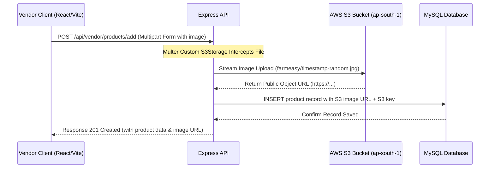

# 🌱 FarmEasy

A professional, production-ready full-stack Agricultural Marketplace built as a feature-rich, high-performance B2C e-commerce platform for the farming community.

FarmEasy serves as a digital bridge between agricultural product companies looking to reach rural buyers, and farmers seeking quality seeds, fertilizers, pesticides, tools, and farming equipment — all without middlemen.

---

## 🚀 Overview of the Project

FarmEasy features a robust architecture combining a React (Vite) frontend with an Express/Node.js backend, powered by MySQL for relational data persistence and AWS S3 for secure, scalable media storage.

### Key Capabilities:
*   **🛒 Direct-to-Farmer Marketplace:** Multi-vendor product catalog with advanced multi-dimensional filtering by category, sub-category, price range, and search terms.
*   **🏪 Vendor Dashboard & Verification:** Dedicated dashboards for vendors to manage inventory, upload product images, track orders, and receive real-time low-stock alerts.
*   **📦 End-to-End Order Management:** Complete order lifecycle from cart and checkout to order tracking and status dispatch (Pending → Confirmed → Shipped → Delivered).
*   **⭐ Reviews & Rating System:** Verified-purchase feedback loops with star ratings and helpful votes to build community trust.
*   **🔔 Smart Notification System:** Automated order lifecycle alerts for buyers and instant order/low-stock notifications for vendors.
*   **📊 Admin Panel:** Full product CRUD, user management, order dispatch controls, and GST verification workflows.
*   **🌐 Multi-Language Support:** Integrated Google Translate API for regional language accessibility.

---

## ⚡ How We Built This Project: The "Vibe Coding" Paradigm

This project is a testament to the modern **"Vibe Coding"** software development model — a highly collaborative, fast-paced, and fluid iteration cycle between the developer (human product engineer) and the AI (Antigravity/Gemini).

### What is Vibe Coding?
Rather than writing boilerplate lines of code or dealing with standard compilation setup loops, Vibe Coding shifts focus to **high-level intent, rapid design, and prompt-driven architecture**.

### Our Vibe Coding Workflow:
1.  **Intent-Driven Iteration:** We set high-level goals (e.g., *"migrate from Cloudinary to AWS S3"* or *"build a smart notification system"*), and let the AI propose files, configurations, and structural changes.
2.  **Live Debugging & Refactoring:** When errors arose — such as MySQL callback issues, API route mismatches, or CORS failures — we solved them through real-time log analysis and prompt-based troubleshooting.
3.  **No Placeholders:** From day one, we committed to building actual, usable endpoints and UI components, avoiding mock files in favor of authentic database schemas, AWS integrations, and React states.
4.  **Flow-State Development:** By automating repetitive boilerplate, the developer maintained a high-velocity product flow, focusing on UX aesthetics ("Farm-Modern" glassmorphism) and architecture while delegating execution and debugging to the AI.

---

## ☁️ AWS S3 Integration & Architecture

To support high-quality product images uploaded by vendors without degrading performance, we integrated **AWS Simple Storage Service (S3)** for all media storage with a custom "Smart Delete" mechanism to prevent orphan storage and reduce costs.

### Architecture Data Flow:


### AWS S3 Implementation Details:

1.  **Custom S3Storage Engine:** The backend uses a custom Multer `StorageEngine` class (`S3Storage`) that buffers the file in memory and streams it directly to the S3 bucket via `putObject`, avoiding temporary disk writes.
2.  **Smart Delete Logic:** When a product or profile is deleted, the backend extracts the S3 key from the stored URL and calls `deleteObject`, ensuring no orphaned files remain in the bucket.
3.  **Permissions & CORS Configuration:**
    *   To allow the React frontend and Express backend to fetch and put resources, the S3 bucket's CORS is configured as:
        ```json
        [
          {
            "AllowedHeaders": ["*"],
            "AllowedMethods": ["GET", "PUT", "POST", "DELETE"],
            "AllowedOrigins": ["https://farmeasy.vercel.app", "http://localhost:5173"],
            "ExposeHeaders": ["ETag"],
            "MaxAgeSeconds": 3000
          }
        ]
        ```
    *   **Public Access:** Enabled public access to bucket objects with `ACL: 'public-read'` set during upload, ensuring product image URLs stored in MySQL are immediately viewable by customers.
4.  **IAM Policy Security:** An IAM User (`farmeasy-s3-user`) was configured on AWS with programmatic access keys, restricted to S3 operations:
    ```json
    {
      "Version": "2012-10-17",
      "Statement": [
        {
          "Effect": "Allow",
          "Action": [
            "s3:GetObject",
            "s3:PutObject",
            "s3:DeleteObject"
          ],
          "Resource": "arn:aws:s3:::farmeasy-uploads/*"
        }
      ]
    }
    ```

---

## 🛠️ Technology Stack

| Layer | Technology | Description |
| :--- | :--- | :--- |
| **Frontend Framework** | `React.js` + `Vite` | High-performance SPA with fast HMR and optimized production builds. |
| **Styling & Animation** | `Tailwind CSS` / `Vanilla CSS` + `Lucide Icons` | "Farm-Modern" glassmorphism aesthetic with responsive, fluid layouts. |
| **Backend API** | `Node.js` & `Express.js` | Modular REST API with async controllers and role-based route validation. |
| **Database** | `MySQL` (Aiven Cloud) | Relational database managing products, users, orders, reviews, and categories. |
| **Storage CDN** | `AWS S3` (ap-south-1) | Distributed, highly available object storage for all product and profile media. |
| **Authentication** | `JSON Web Tokens (JWT)` & `BcryptJS` | Secure stateless auth with one-way password hashing. |
| **Email Service** | `Nodemailer` | Automated transactional emails for order confirmations and vendor alerts. |
| **Translation** | `Google Translate API` | Real-time multi-language support for regional farmer accessibility. |
| **CI/CD** | `GitHub Actions` | Automated linting, testing, and deployment pipeline. |
| **Deployment** | `Vercel` (Frontend) + `Render` (Backend) | Production-grade cloud deployment with automatic previews. |

---

## 🏃‍♂️ Getting Started

### 1. Prerequisites
*   Node.js (v18.x or higher)
*   MySQL Instance (Local or Aiven Cloud URI)
*   AWS S3 Bucket with programmatically generated Access Key & Secret
*   A Nodemailer-compatible email account (e.g., Gmail App Password)

### 2. Environment Setup

Create a `.env` file in the `backend` directory:
```env
# Server
PORT=5000
NODE_ENV=development

# Database
DB_HOST=your_mysql_host
DB_PORT=3306
DB_USER=your_mysql_user
DB_PASSWORD=your_mysql_password
DB_NAME=farmeasy

# Authentication
JWT_SECRET=your_jwt_secret_key_here

# AWS S3 Configuration
AWS_REGION=ap-south-1
AWS_ACCESS_KEY_ID=your_aws_access_key_id
AWS_SECRET_ACCESS_KEY=your_aws_secret_access_key
AWS_S3_BUCKET_NAME=farmeasy-uploads
AWS_S3_FOLDER=farmeasy

# Email (Nodemailer)
NODEMAILER_EMAIL=noreply@farmeasy.com
NODEMAILER_PASSWORD=your_app_password

# Google Translate
GOOGLE_TRANSLATE_API_KEY=your_key
```

Create a `.env` file in the `frontend` directory:
```env
VITE_API_URL=http://localhost:5000
```

### 3. Installation
Install dependencies for both backend and frontend concurrently using the workspace script:
```bash
npm install
npm run dev
```

Or install manually:
```bash
# Install backend dependencies
cd backend && npm install

# Install frontend dependencies
cd ../frontend && npm install
```

### 4. Database Setup
Import the schema into your MySQL instance:
```bash
# 1. Login to MySQL
mysql -u root -p

# 2. Create database
CREATE DATABASE farmeasy;
exit

# 3. Import schema
mysql -u root -p farmeasy < backend/schema.sql
```

### 5. Running the Application
Launch both backend and frontend servers concurrently from the root:
```bash
npm run dev
```
*   **Frontend client:** http://localhost:5173
*   **Backend API server:** http://localhost:5000

---

## 📁 Key File Structure

```
farmeasy/
├── backend/
│   ├── config/          # DB connection pool, AWS S3 client config
│   ├── controllers/     # Controller layer (auth, vendor, customer, admin, reviews)
│   ├── middleware/      # Auth shields, role-check middleware, S3 upload engine
│   ├── models/          # MySQL query models for all entities
│   ├── routes/          # REST route declarations
│   ├── services/        # Email service (Nodemailer), notification logic
│   ├── migrations/      # Incremental SQL migration scripts
│   ├── schema.sql       # Full database schema (source of truth)
│   └── server.js        # Main Express engine entry point
└── frontend/
    ├── src/
    │   ├── components/  # Shared UI components (Navbar, ProductCard, VendorDashboard)
    │   ├── pages/       # Route-level page components (Home, Cart, Admin, Auth)
    │   ├── context/     # React Context (Auth, Cart, Notification state)
    │   ├── hooks/       # Custom React hooks
    │   └── config.js    # API base URL and global constants
    └── public/          # Static assets (favicon, logos)
```

---

## 🔒 Security Best Practices Implementations
*   **Secret Management:** No credentials or access keys are ever hardcoded in the codebase. All runtime constants are driven by environment variables and IAM-restricted AWS policies.
*   **Role-Based Access Control (RBAC):** Middleware checks verify whether requests originate from verified Customers, Vendors, or Administrators before granting route access.
*   **Password Hashing:** Implemented one-way salt hashing using `bcryptjs` before committing user profiles to MySQL.
*   **Input Validation:** File upload middleware enforces MIME-type allowlisting (JPEG, PNG, WebP, AVIF) and a 10MB file size cap to prevent abuse.
*   **Smart S3 Delete:** Every image deletion operation removes the corresponding S3 object, preventing cost accumulation from orphaned files.
